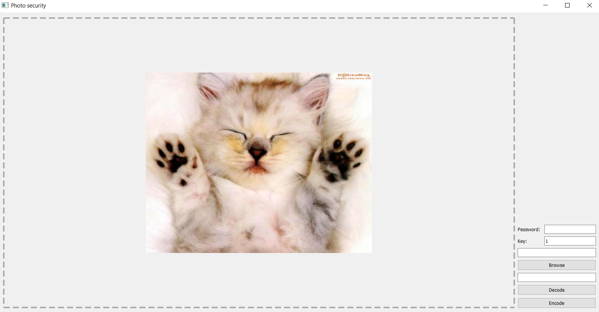
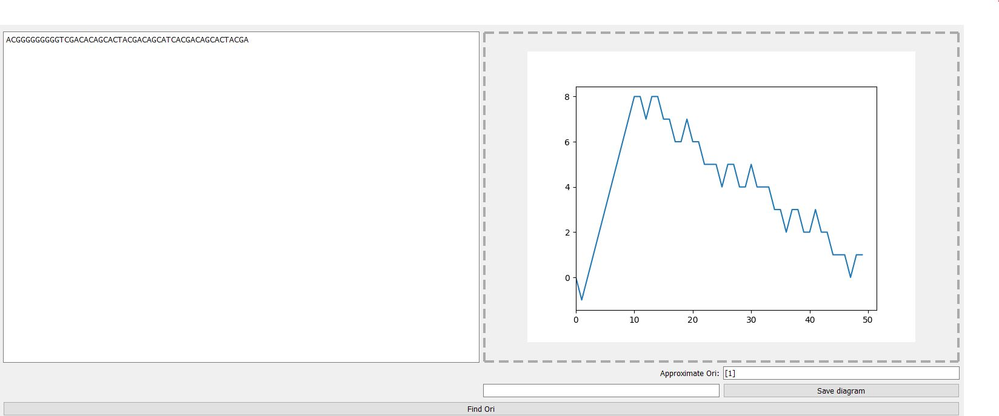
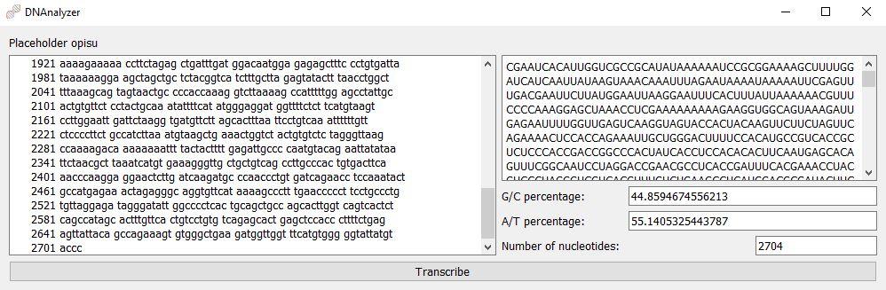
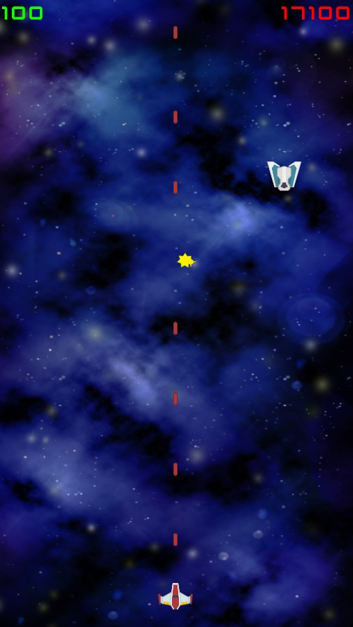

## Python projects
### Image encoding app
  This app utilize numpy to transform images into 3D arrays using a given key and saves it as .csv file. Decoding the image require the same key that was set during encoding. 

Used libraries:
* NumPy
* Pandas
* PyQt
* cv2 

### Bioinformatic tool
  This is a DNA analyzing bioinformatic tool made based on Finding Hidden Messages in DNA (Bioinformatics I) course on Coursera provided by University of California San Diego, and my own effort. Current features include transcription, translation, enzymatic restriction and finding origin of replication. Curently still in progress as I am constantly adding or improving features.

Used libraries: 
* PyQt
* MatPlotLib
* Pandas
* OpenPyxl
* sqlite3
* itertools

Findign the origin of repliction:

Transcribing:

 
### Youtube downloader

Used libraries: 
* pytube

## C# projects
### Space shooter
Simple scrolling shooter made in Unity. Currently have only few waves but it is a fully functional demo.

### Falgrim Defence
